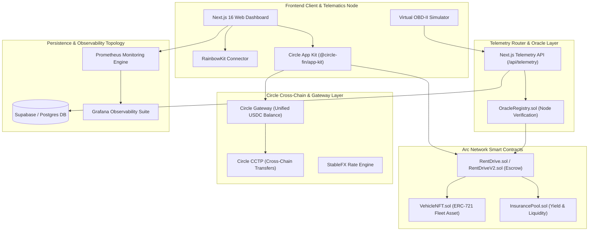

# RentDrive ⚡🚘
### Decentralized Peer-to-Peer Telematics Commerce Protocol on Arc Network

RentDrive is an enterprise-grade, decentralized P2P car-sharing and autonomous fleet protocol engineered for the **Arc Network**. Utilizing **USDC as native gas**, **Circle App Kit**, **Circle CCTP & Gateway**, and **smart contract telemetry escrows**, RentDrive eliminates traditional rental intermediaries, reduces collateral risk through IoT telematics, and enables per-kilometer micro-settlements for modern mobility networks.

---

> [!IMPORTANT]
> **Arc Native Gas Integration:** RentDrive executes all state transitions and micro-billing transfers directly using native USDC on Arc Testnet (`Chain ID: 5042002`). No secondary gas token wrapping is required.

---

## 🎯 Core Modules & Capabilities

### 🛡️ Crash-Sensor Triggered Escrow & Dispute Resolution
* **Autonomous Escrow Locking:** Upon lease initialization, renter collateral is locked directly into the `RentDrive.sol` contract state machine.
* **On-Chain Oracle Attestation:** Telemetry data carrying impact vectors (`crashDetected == true`) from authenticated OBD-II nodes instantly transitions the lease to a `Disputed` state.
* **Administrative Split Engine:** Smart contract settlement logic calculates damages and executes a proportional split between the vehicle owner (indemnification) and the renter (remaining collateral refund).

### 📏 Per-Kilometer Micro-Billing Stream
* **Metered Telematics Pricing:** Renter billing is calculated dynamically against elapsed distance, overriding rigid daily minimums.
* **Stream Delta Calculations:** Odometer telemetry increments reported via signed oracle payloads calculate exact micro-deductions from the locked escrow balance based on owner-configured rates (e.g. `0.50 USDC/km`).

### ⚡ Automated Speed-Limit Penalty Billing
* **Autonomous Penalty Enforcement:** Fleet owners specify maximum velocity thresholds (`speedLimit`) and infraction penalty rates (`penaltyFee`) within contract parameters.
* **Instant Deductions:** Telemetry frames exceeding speed thresholds automatically disburse penalty amounts from renter collateral directly into the owner's withdrawable yield pool.

### 🚗 Tokenized Fleet Assets (ERC-721 VehicleNFT)
* **On-Chain Property Rights:** Every vehicle registered on RentDrive is minted as a unique `VehicleNFT` token, containing embedded metadata, telemetry parameters, and ownership rights.
* **Fractionalized Fleet Management:** Vehicle NFTs can be transferred, delegated, or integrated into decentralized insurance and liquidity pools.

---

## 📐 System Design & Protocol Architecture



---

## 💾 Persistence & Smart Contract Topology

### Smart Contract Suite Summary

| Contract | Primary Role | Key State Variables / Functions |
|---|---|---|
| `RentDrive.sol` | Core Escrow & Rental State Machine | `rentals`, `createRental()`, `completeRental()`, `resolveDispute()` |
| `RentDriveV2.sol` | Extended Micro-Billing & Speed Enforcement | `updateTelemetry()`, `applySpeedPenalty()`, `meteredDeduction()` |
| `VehicleNFT.sol` | Fleet Tokenization (ERC-721) | `mintVehicle()`, `tokenURI()`, `ownerVehicles()` |
| `OracleRegistry.sol` | Authorized OBD-II Telematics Nodes | `registerOracle()`, `verifySignature()`, `authorizedNodes` |
| `InsurancePool.sol` | Liquidity & Collateral Risk Reserve | `depositLiquidity()`, `underwriteRisk()`, `claimPayout()` |

### Database Schema Architecture (`supabase_schema.sql`)
RentDrive enforces a hybrid storage architecture: smart contract state stores core financial escrows while PostgreSQL (Supabase) stores indexed telemetry logs, vehicle metadata, and historical sensor streams.

```sql
-- Telemetry Logs Index Table
CREATE TABLE telemetry_logs (
    id UUID PRIMARY KEY DEFAULT gen_random_uuid(),
    rental_id BIGINT NOT NULL,
    vehicle_id BIGINT NOT NULL,
    speed NUMERIC(5,2) NOT NULL,
    latitude NUMERIC(10,8),
    longitude NUMERIC(11,8),
    odometer NUMERIC(10,2) NOT NULL,
    crash_detected BOOLEAN DEFAULT FALSE,
    created_at TIMESTAMP WITH TIME ZONE DEFAULT NOW()
);
```

> [!NOTE]
> **Zero-Config Fallback:** If Supabase environment variables are unconfigured during local development, `src/lib/supabase.ts` automatically switches to an isolated file-backed JSON database engine (`db.json`) without interrupting runtime operations.

---

## 💱 Cross-Chain & Commerce Stack Engine

RentDrive integrates Circle's complete stablecoin commerce stack to enable seamless liquidity management:

1. **Circle App Kit (`@circle-fin/app-kit`):** Provides gasless Web3 wallet authentication and in-app USDC balance management via `@circle-fin/adapter-viem-v2`.
2. **Circle CCTP (`src/lib/cctp.ts`):** Cross-Chain Transfer Protocol integration enabling renters from Ethereum, Base, or Arbitrum to deposit USDC directly into Arc Testnet escrows.
3. **Circle Gateway (`src/lib/gateway.ts`):** Unified multi-chain USDC liquidity router for instant cross-chain rental settlements (<500ms finality).
4. **StableFX (`src/lib/stablefx.ts`):** Automated micro-currency exchange rate engine for real-time local currency pricing display.

---

## 🐳 Enterprise Deployment & Infrastructure Layout

The RentDrive infrastructure is containerized with Docker and ready for high-availability production deployment via Kubernetes.

```
k8s/
├── configmap.yaml     # Application configuration environment variables
├── secret.yaml        # Encrypted private keys & API credentials
├── deployment.yaml    # Production deployment specs with rolling updates
├── service.yaml       # LoadBalancer service mapping port 80 -> 3000
├── ingress.yaml       # NGINX Ingress controller configuration
└── hpa.yaml           # Horizontal Pod Autoscaler (Target CPU: 70%, Min: 2, Max: 10)
```

### Production Multi-Service Container Orchestration (`docker-compose.yml`)

To start the full production stack including the application, PostgreSQL, Prometheus, and Grafana:

```bash
docker-compose up -d --build
```

#### Monitored Services & Endpoints
* **RentDrive App:** `http://localhost:3000`
* **PostgreSQL Database:** `localhost:5432`
* **Prometheus Engine:** `http://localhost:9090`
* **Grafana Dashboards:** `http://localhost:3001` (Default Login: `admin` / `admin`)

---

## ⚡ Local Environment & Bootstrap Process

### Prerequisites
* **Node.js:** `v20.0.0` or higher
* **npm:** `v10.0.0` or higher

### 1. Repository Setup & Dependency Installation
```bash
git clone https://github.com/trchithuy71/RentDrive.git
cd RentDrive
npm install --legacy-peer-deps
```

### 2. Admin & Oracle Wallet Generation
Run the automated private key generator script:
```bash
node scripts/generate-wallet.js
```
* **Output:** Creates `.env` populated with a private key.
* **Action:** Request Arc Testnet USDC gas from the [Circle Faucet](https://faucet.circle.com) for the generated address.

### 3. Smart Contract Compilation & Arc Deployment
Compile all Solidity contracts using the IR-optimized solver:
```bash
node scripts/compile.js
```

Deploy `RentDrive.sol` to Arc Testnet:
```bash
node scripts/deploy.js
```
Update `.env` with the output contract address:
```env
NEXT_PUBLIC_RENTDRIVE_CONTRACT_ADDRESS="0xYourDeployedContractAddress"
```

### 4. Launching Development Server
```bash
npm run dev
```
Navigate to `http://localhost:3000` in your web browser.

---

## 🧪 IoT OBD-II Telematics Verification & Simulation Suite

RentDrive features a virtual OBD-II telematics simulation console to simulate real-world vehicle events:

```
[ Marketplace ] ──> [ Select Vehicle ] ──> [ Lock USDC Escrow ]
                                                    │
[ ArcScan Verification ] <── [ Auto Drive ] <─── [ OBD-II Simulator ]
```

### Verification Flow
1. **Initiate Lease:** Select a vehicle in the **Marketplace** and complete the USDC deposit transaction.
2. **Launch Simulator:** Navigate to the **IoT Simulator** tab and select the active lease token.
3. **Speed Penalty Test:** Drag the velocity slider beyond `100 km/h`. Observe the instant state update and micro-penalty deduction on-chain.
4. **Collision Incident Test:** Press **Trigger Collision**. Verify that the contract locks the escrow in a `Disputed` state.
5. **Auto Drive Streaming:** Enable **Auto Drive** to broadcast signed telemetry packets every 3 seconds, demonstrating real-time per-kilometer micro-billing settlement on Arc Testnet.

---

## 🛡️ Security Architecture & Trust Model

* **On-Chain Telematics Signatures:** Oracle telemetry frames are validated against authorized cryptographic signatures in `OracleRegistry.sol` to prevent spoofed location or odometer reports.
* **Non-Reentrant Escrow Mutators:** `RentDrive.sol` utilizes OpenZeppelin-inspired reentrancy guards on all withdrawal and settlement functions (`nonReentrant`).
* **Role-Based Access Control (RBAC):** Admin parameters (speed thresholds, dispute resolvers) are restricted strictly to contract owner roles via modifiers.
* **Isolated Environment Key Isolation:** Private key handling is encapsulated within server-side API routes and Kubernetes secret stores, preventing key exposure to client-side runtimes.

---

<p align="center">
Built with ⚡ for the Arc Network & Circle Stablecoins Commerce Stack Challenge.
</p>
