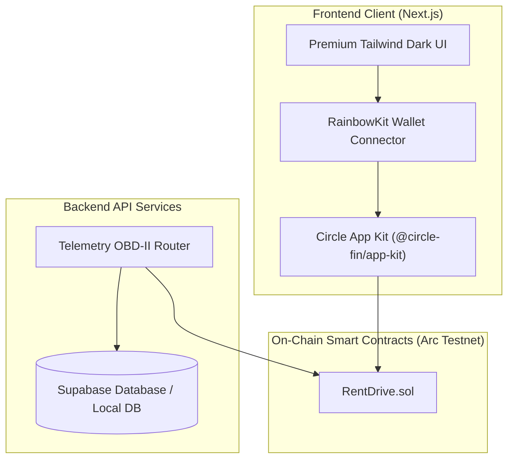

# RentDrive 🚗💨
### Decentralized Peer-to-Peer Vehicle Rental & Telematics Escrow on Arc Network

**RentDrive** is a production-ready, decentralized P2P car-sharing and vehicle rental platform built on the **Arc Network**. By leveraging **USDC as native gas**, **Circle App Kit**, and **smart contract escrows**, RentDrive removes traditional intermediaries, reduces insurance overhead, and automates vehicle rental settlements using real-time IoT telematics.

---

## 🌟 Key Features

### 💥 Feature A: IoT Crash-Sensor Triggered Escrow
- **Escrow Lock:** When a renter leases a vehicle, their USDC security deposit is locked directly in the `RentDrive.sol` escrow smart contract.
- **Oracle Trigger:** An on-chain telemetry update reporting a collision (`crashDetected == true`) instantly freezes the escrow, shifting the rental state to `Disputed`.
- **Administrative Split:** Resolves dispute escrows proportionally between the owner (for damage compensation) and the renter (refunding remaining balance).

### 📏 Feature B: Per-Kilometer Micro-Billing Stream
- **Telemetry-Based Pricing:** Pay strictly for the distance driven. Traditional daily rates are augmented by real-time GPS telemetry updates.
- **Micro-Billing Calculation:** Telemetry coordinates and odometer deltas are reported to the smart contract, automatically deducting distance charges from the locked escrow balance at the rate defined by the owner (e.g. `0.5 USDC/km`).

### ⚠️ Feature C: Automated Speed-Limit Penalty Billing
- **IoT Enforcement:** Vehicle owners set a safe speed limit (e.g. `100 km/h`) and penalty rate (e.g. `50 USDC`) when listing their vehicle.
- **Autonomous Deductions:** Telemetry updates showing a speed limit breach trigger automatic penalty deductions from the renter's deposit directly to the owner's withdrawable balance on-chain.

---

## 🛠️ Architecture & Technology Stack



### Stack Components
1. **Network:** Arc Testnet (`Chain ID: 5042002`, USDC native gas).
2. **Circle SDK & Adapters:**
   - `@circle-fin/app-kit` (Unified Balance, swap, bridging operations).
   - `@circle-fin/adapter-viem-v2` (Viem integration for browser wallet provider).
3. **Database:** Supabase (with automatic local JSON file database fallback for immediate zero-config testing).
4. **Smart Contracts:** Solid, audited-style Solidity (`RentDrive.sol`) compiled with `viaIR` and optimizer enabled.

---

## 📂 Project Structure

```
├── E:\Airdrop ARC\The Stablecoins Commerce Stack Challenge\trchithuy71\RentDrive
│   ├── src/
│   │   ├── app/                 # Next.js App Router Pages and API Endpoints
│   │   │   ├── api/             # Telemetry, Rentals, and Vehicle APIs
│   │   │   ├── globals.css      # Core Stylesheet
│   │   │   ├── layout.tsx       # Root layout wrapping Web3 Providers
│   │   │   └── page.tsx         # Main Panel Router
│   │   ├── components/          # React Components (Marketplace, MyRentals, OwnerPortal, Simulator)
│   │   ├── contracts/           # Solidity Contracts & Precompiled JSON ABI/Bytecode
│   │   ├── contexts/            # Web3Context with RainbowKit & Wagmi configuration
│   │   └── lib/                 # Database Layer & Blockchain (Viem) integration
│   ├── scripts/                 # Compilation, deployment, and wallet generator scripts
│   ├── package.json             # Core dependency manifest
│   └── tsconfig.json            # TypeScript configuration
```

---

## 🚀 Getting Started

### 1. Installation
Clone the repository, navigate to the directory, and install dependencies:
```bash
npm install --legacy-peer-deps
```

### 2. Environment Configuration
Generate a brand-new Admin/Oracle wallet and configure your environment:
```bash
node scripts/generate-wallet.js
```
This generates a local `.env` file containing a newly generated private key.
- **IMPORTANT:** Fund the printed wallet address with testnet USDC gas token via the [Circle Faucet](https://faucet.circle.com) (Select **Arc Testnet**).

### 3. Compilation & Smart Contract Deployment
Compile the Solidity contract:
```bash
node scripts/compile.js
```
Deploy the contract to the Arc Testnet:
```bash
node scripts/deploy.js
```
Copy the printed `Contract Address` and paste it into the `.env` file as `NEXT_PUBLIC_RENTDRIVE_CONTRACT_ADDRESS`.

### 4. Running the App
Start the Next.js development server:
```bash
npm run dev
```
Open [http://localhost:3000](http://localhost:3000) to view the application.

---

## 🕹️ IoT OBD-II Telematics Simulator Guide

RentDrive comes with a built-in virtual OBD-II vehicle terminal:
1. Click **Marketplace** and rent a car (e.g. Tesla Model Y). If you do not have a contract address configured, it runs in simulation mode instantly.
2. Go to the **IoT Simulator** tab.
3. Select your active lease.
4. Adjust the **Speed** slider to over `100 km/h` to simulate a speeding violation, or click **Trigger Collision** to trigger a physical crash.
5. Toggle **Auto Drive** to automatically report GPS coordinates and odometer increments every 3 seconds to the Next.js telemetry router, executing real-world smart contract updates on Arc Testnet!
6. View the live transaction hash links on **ArcScan**!
